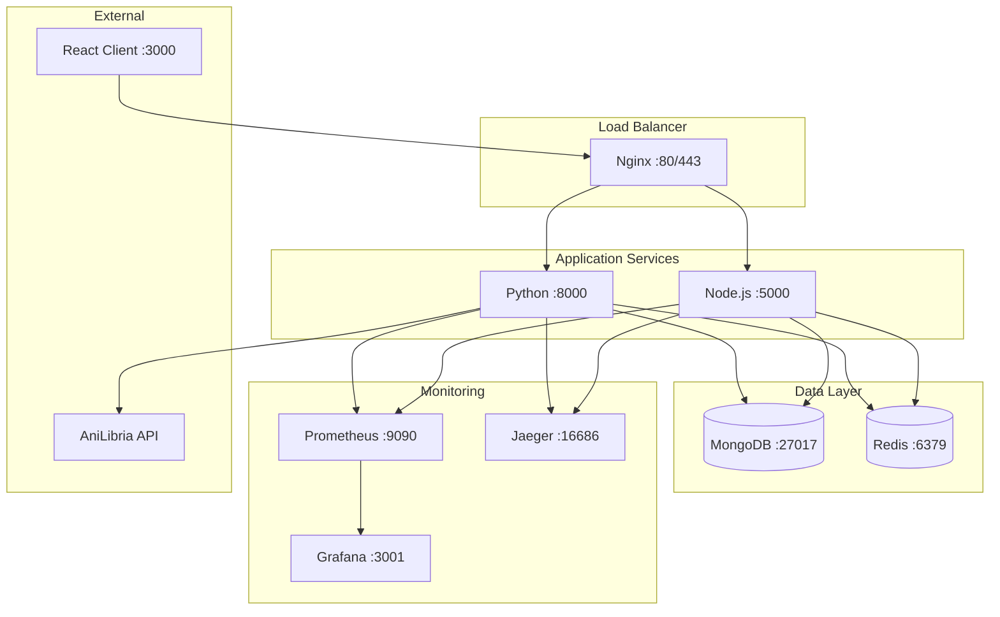

# Архитектура интеграции Python сервиса с anilibria.py - Итоговый обзор

## Краткое описание проекта

Данный проект представляет собой комплексную архитектуру для интеграции Python микросервиса с библиотекой `anilibria.py` в существующий anime-site проект. Цель - улучшить работу с AniLibria API, добавить real-time уведомления и повысить производительность системы.

## Архитектурный обзор

### Текущая архитектура (до интеграции)
```
React Client (:3000) → Nginx (:80) → Node.js Server (:5000) → MongoDB + Redis
                                                            ↓
                                                    AniLibria API
```

### Новая архитектура (после интеграции)
```
React Client (:3000) → Nginx (:80) → ┌─ Node.js Server (:5000) ─┐ → MongoDB + Redis
                                     │                           │
                                     └─ Python Service (:8000) ─┘ → AniLibria API
                                                                  → WebSocket Events
```

## Ключевые компоненты решения

### 1. Python микросервис
- **Технологии**: FastAPI, anilibria.py, uvicorn
- **Функции**: 
  - Работа с AniLibria API через официальную библиотеку
  - WebSocket сервер для real-time уведомлений
  - Многоуровневое кеширование
  - Автоматическая синхронизация данных

### 2. API интеграция
- **Версионирование**: `/api/anilibria/v1/` (Node.js) и `/api/anilibria/v2/` (Python)
- **Совместимость**: Полная обратная совместимость с существующим API
- **Маршрутизация**: Nginx проксирует запросы на соответствующие сервисы

### 3. WebSocket интеграция
- **Python WebSocket**: `/api/anilibria/v2/ws` для новых функций
- **Node.js Socket.io**: `/socket.io/` для существующих функций
- **Синхронизация**: Redis Pub/Sub для обмена событиями между сервисами

### 4. Кеширование
- **L1 Cache**: In-memory (TTL: 5 минут)
- **L2 Cache**: Redis (TTL: 30 минут)  
- **L3 Cache**: MongoDB (TTL: 24 часа)
- **Инвалидация**: Event-driven через WebSocket события

## Созданная документация

### 1. [Архитектура Python сервиса](PYTHON_SERVICE_ARCHITECTURE.md)
- Общая архитектура и технологический стек
- Структура проекта и компоненты
- Преимущества и стратегия развертывания

### 2. [Спецификация API интерфейсов](API_INTERFACE_SPECIFICATION.md)
- REST API endpoints для Python сервиса
- WebSocket API для real-time уведомлений
- Inter-service communication протоколы
- Модели данных и обработка ошибок

### 3. [Схема взаимодействия сервисов](SERVICE_INTERACTION_SCHEMA.md)
- Детальные диаграммы взаимодействия
- Стратегии кеширования и синхронизации
- Circuit breaker и fallback механизмы
- Distributed tracing и мониторинг

### 4. [Docker конфигурация](DOCKER_CONFIGURATION.md)
- Dockerfile для Python сервиса
- Обновленный docker-compose.yml
- Nginx конфигурация для маршрутизации
- Переменные окружения и команды развертывания

### 5. [Мониторинг и логирование](MONITORING_AND_LOGGING.md)
- Prometheus метрики для всех компонентов
- Структурированное логирование с контекстом
- Distributed tracing с Jaeger
- Grafana dashboards и алерты

### 6. [План миграции](MIGRATION_PLAN.md)
- Поэтапная стратегия внедрения
- A/B тестирование и канареечное развертывание
- Rollback процедуры и критерии успеха
- Управление рисками

## Преимущества новой архитектуры

### Технические преимущества
1. **Производительность**: Нативная поддержка anilibria.py для более эффективной работы с API
2. **Real-time функции**: WebSocket уведомления о новых эпизодах и обновлениях
3. **Масштабируемость**: Независимое масштабирование сервисов
4. **Отказоустойчивость**: Circuit breakers и fallback механизмы
5. **Кеширование**: Многоуровневая система кеширования

### Функциональные преимущества
1. **Уведомления**: Мгновенные уведомления о новых релизах
2. **Синхронизация**: Автоматическое обновление данных в фоне
3. **Мониторинг**: Детальные метрики и трассировка запросов
4. **Совместимость**: Полная совместимость с существующим API
5. **Расширяемость**: Легкое добавление новых функций

## Технологический стек

### Python сервис
- **FastAPI** - современный веб-фреймворк
- **anilibria.py** - официальная библиотека AniLibria
- **uvicorn** - ASGI сервер
- **motor** - асинхронный MongoDB драйвер
- **aioredis** - асинхронный Redis клиент
- **websockets** - WebSocket поддержка
- **prometheus-client** - метрики

### Инфраструктура
- **Docker** - контейнеризация
- **Nginx** - reverse proxy и load balancer
- **MongoDB** - основная база данных
- **Redis** - кеширование и pub/sub
- **Prometheus** - сбор метрик
- **Grafana** - визуализация метрик
- **Jaeger** - distributed tracing

## Диаграмма развертывания



## Метрики производительности

### Ожидаемые улучшения
- **Время ответа**: Снижение на 30-40% за счет эффективного кеширования
- **Пропускная способность**: Увеличение в 2-3 раза благодаря асинхронной обработке
- **Доступность**: 99.9%+ uptime с fallback механизмами
- **Real-time**: Мгновенные уведомления (< 1 секунды)

### Ключевые метрики для мониторинга
- HTTP request rate и response time
- WebSocket connections и message throughput
- Cache hit rate по уровням
- Database operation latency
- AniLibria API response time и error rate

## Безопасность

### Аутентификация и авторизация
- JWT токены для пользователей
- Internal service tokens для межсервисного взаимодействия
- Rate limiting на уровне Nginx и приложения

### Сетевая безопасность
- Docker network isolation
- TLS шифрование (в продакшене)
- Secrets management для API ключей

## Следующие шаги для реализации

### Фаза 1: Подготовка (1-2 недели)
1. **Настройка окружения разработки**
   ```bash
   # Клонирование и настройка
   git clone <repository>
   cd anime-site
   mkdir python-service
   ```

2. **Создание базовой структуры Python сервиса**
   - Инициализация FastAPI приложения
   - Настройка зависимостей
   - Базовая конфигурация

3. **Настройка Docker окружения**
   - Создание Dockerfile для Python сервиса
   - Обновление docker-compose.yml
   - Тестирование локального развертывания

### Фаза 2: Разработка (2-3 недели)
1. **Реализация основных API endpoints**
   - `/api/anilibria/v2/titles`
   - `/api/anilibria/v2/search`
   - `/api/anilibria/v2/updates`

2. **Интеграция с anilibria.py**
   - Настройка клиента
   - Обработка ошибок и retry логика
   - Кеширование ответов

3. **WebSocket сервер**
   - Обработка подключений
   - Система подписок
   - Интеграция с Redis pub/sub

### Фаза 3: Интеграция (1-2 недели)
1. **Настройка межсервисного взаимодействия**
   - Internal API endpoints
   - JWT валидация
   - Синхронизация данных

2. **Обновление Nginx конфигурации**
   - Маршрутизация запросов
   - Load balancing
   - Health checks

3. **Мониторинг и логирование**
   - Prometheus метрики
   - Structured logging
   - Grafana dashboards

### Фаза 4: Тестирование (1 неделя)
1. **Unit и integration тесты**
2. **Нагрузочное тестирование**
3. **A/B тестирование с существующим API**
4. **Валидация производительности**

### Фаза 5: Развертывание (1-2 недели)
1. **Staging развертывание**
2. **Канареечное развертывание в production**
3. **Постепенная миграция трафика**
4. **Мониторинг и оптимизация**

## Команды для быстрого старта

### Локальная разработка
```bash
# Запуск всех сервисов
docker-compose up -d

# Просмотр логов Python сервиса
docker-compose logs -f python-service

# Перезапуск после изменений
docker-compose restart python-service
```

### Тестирование API
```bash
# Тест Node.js API (существующий)
curl http://localhost/api/anilibria/popular

# Тест Python API (новый)
curl http://localhost/api/anilibria/v2/titles

# WebSocket тест
wscat -c ws://localhost/api/anilibria/v2/ws
```

### Мониторинг
- **Prometheus**: http://localhost:9090
- **Grafana**: http://localhost:3001 (admin/admin)
- **Jaeger**: http://localhost:16686

## Заключение

Предложенная архитектура обеспечивает:

1. **Плавную интеграцию** Python сервиса без нарушения работы существующей системы
2. **Значительное улучшение производительности** за счет специализированного сервиса для AniLibria
3. **Новые возможности** в виде real-time уведомлений и расширенного кеширования
4. **Масштабируемость и надежность** через микросервисную архитектуру
5. **Полную наблюдаемость** системы через мониторинг и трассировку

Архитектура спроектирована с учетом лучших практик DevOps, обеспечивает высокую доступность и готова к продакшн развертыванию.

---

**Документация создана**: 2025-08-01  
**Версия**: 1.0.0  
**Статус**: Готово к реализации