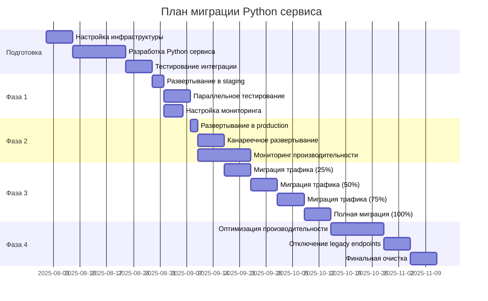

# План миграции и совместимости с существующим API

## Обзор стратегии миграции

### Принципы миграции
1. **Zero Downtime**: Миграция без остановки сервиса
2. **Backward Compatibility**: Полная совместимость с существующим API
3. **Gradual Rollout**: Поэтапное внедрение новых функций
4. **Rollback Ready**: Возможность быстрого отката
5. **Data Consistency**: Сохранение целостности данных

### Временная шкала миграции



## Фазы миграции

### Фаза 1: Подготовка и настройка инфраструктуры

#### 1.1 Настройка окружения
```bash
# Создание Python сервиса
mkdir python-service
cd python-service

# Инициализация проекта
python -m venv venv
source venv/bin/activate  # Linux/Mac
# venv\Scripts\activate   # Windows

pip install -r requirements.txt

# Настройка Docker
docker build -t anime-site-python:dev .
```

#### 1.2 Конфигурация базы данных
```javascript
// Добавление индексов для Python сервиса
db.titles.createIndex({ "aniLibriaId": 1 }, { unique: true })
db.titles.createIndex({ "names.ru": "text", "names.en": "text" })
db.titles.createIndex({ "genres": 1 })
db.titles.createIndex({ "year": 1, "season": 1 })
db.titles.createIndex({ "status": 1 })
db.titles.createIndex({ "lastSynced.anilibria": 1 })

// Создание коллекции для синхронизации
db.sync_status.createIndex({ "service": 1, "entity_type": 1, "entity_id": 1 }, { unique: true })
```

#### 1.3 Настройка Redis для кеширования
```redis
# Настройка Redis namespaces
# anilibria:v1:* - для Node.js сервиса
# anilibria:v2:* - для Python сервиса
# shared:* - для общих данных

CONFIG SET maxmemory 512mb
CONFIG SET maxmemory-policy allkeys-lru
```

### Фаза 2: Развертывание Python сервиса

#### 2.1 Обновление docker-compose.yml
```yaml
# Добавление Python сервиса в существующий docker-compose.yml
services:
  python-service:
    build:
      context: ./python-service
      dockerfile: Dockerfile
    environment:
      - ENVIRONMENT=staging
      - MIGRATION_MODE=true  # Специальный режим для миграции
    # ... остальная конфигурация
```

#### 2.2 Обновление Nginx конфигурации
```nginx
# Добавление upstream для Python сервиса
upstream python-backend {
    server python-service:8000;
}

# Условная маршрутизация на основе заголовков
location /api/anilibria/ {
    # Проверяем заголовок для выбора версии API
    if ($http_x_api_version = "v2") {
        proxy_pass http://python-backend/;
    }
    
    # По умолчанию используем Node.js сервис
    proxy_pass http://nodejs-backend/;
}
```

#### 2.3 Настройка мониторинга
```yaml
# Обновление prometheus.yml
scrape_configs:
  - job_name: 'anilibria-python-service'
    static_configs:
      - targets: ['python-service:8000']
    metrics_path: '/metrics'
    scrape_interval: 15s
```

### Фаза 3: Параллельное тестирование

#### 3.1 A/B тестирование
```python
# Middleware для A/B тестирования
class ABTestMiddleware(BaseHTTPMiddleware):
    async def dispatch(self, request: Request, call_next):
        # Определяем группу пользователя
        user_id = self.extract_user_id(request)
        test_group = self.get_test_group(user_id)
        
        # Добавляем заголовок для идентификации
        request.headers["X-Test-Group"] = test_group
        
        response = await call_next(request)
        response.headers["X-Test-Group"] = test_group
        
        return response
    
    def get_test_group(self, user_id: str) -> str:
        # Простое хеширование для распределения пользователей
        if not user_id:
            return "control"
        
        hash_value = hash(user_id) % 100
        
        # 10% пользователей получают новый API
        if hash_value < 10:
            return "python_service"
        else:
            return "nodejs_service"
```

#### 3.2 Сравнительное тестирование
```python
# Сервис для сравнения ответов
class ComparisonService:
    async def compare_responses(self, endpoint: str, params: dict):
        # Запрос к Node.js сервису
        nodejs_response = await self.call_nodejs_service(endpoint, params)
        
        # Запрос к Python сервису
        python_response = await self.call_python_service(endpoint, params)
        
        # Сравнение результатов
        comparison_result = self.compare_data(nodejs_response, python_response)
        
        # Логирование различий
        if not comparison_result.is_equal:
            logger.warning(
                "Response mismatch detected",
                endpoint=endpoint,
                differences=comparison_result.differences,
                nodejs_count=len(nodejs_response.get('data', [])),
                python_count=len(python_response.get('data', []))
            )
        
        return comparison_result
```

### Фаза 4: Постепенная миграция трафика

#### 4.1 Канареечное развертывание
```nginx
# Nginx конфигурация для канареечного развертывания
upstream nodejs-backend {
    server server:5000 weight=90;  # 90% трафика
}

upstream python-backend {
    server python-service:8000 weight=10;  # 10% трафика
}

# Постепенное увеличение веса Python сервиса
# Неделя 1: 10%
# Неделя 2: 25%
# Неделя 3: 50%
# Неделя 4: 75%
# Неделя 5: 100%
```

#### 4.2 Feature Flags
```python
# Система feature flags для контроля миграции
class FeatureFlags:
    def __init__(self, redis_client):
        self.redis = redis_client
    
    async def is_enabled(self, flag_name: str, user_id: str = None) -> bool:
        # Глобальные флаги
        global_flag = await self.redis.get(f"feature:{flag_name}:global")
        if global_flag == "disabled":
            return False
        
        # Пользовательские флаги
        if user_id:
            user_flag = await self.redis.get(f"feature:{flag_name}:user:{user_id}")
            if user_flag:
                return user_flag == "enabled"
        
        # Процентное включение
        percentage = await self.redis.get(f"feature:{flag_name}:percentage")
        if percentage:
            user_hash = hash(user_id or "anonymous") % 100
            return user_hash < int(percentage)
        
        return global_flag == "enabled"

# Использование в коде
feature_flags = FeatureFlags(redis_client)

@app.get("/api/anilibria/titles")
async def get_titles(request: Request):
    user_id = extract_user_id(request)
    
    if await feature_flags.is_enabled("python_service_titles", user_id):
        return await python_service.get_titles(request)
    else:
        return await nodejs_service.get_titles(request)
```

### Фаза 5: Обеспечение совместимости

#### 5.1 API версионирование
```python
# Поддержка множественных версий API
@app.get("/api/anilibria/v1/titles")
async def get_titles_v1(request: Request):
    """Совместимость с существующим Node.js API"""
    python_response = await python_service.get_titles(request)
    
    # Преобразование в формат v1
    return transform_to_v1_format(python_response)

@app.get("/api/anilibria/v2/titles")
async def get_titles_v2(request: Request):
    """Новый улучшенный API"""
    return await python_service.get_titles(request)

def transform_to_v1_format(v2_response):
    """Преобразование ответа v2 в формат v1 для совместимости"""
    return {
        "success": v2_response.get("success", True),
        "data": [
            {
                # Маппинг полей для совместимости
                "id": item["id"],
                "names": item["names"],
                "description": item["description"],
                # ... остальные поля
            }
            for item in v2_response.get("data", [])
        ],
        "pagination": v2_response.get("pagination", {})
    }
```

#### 5.2 Синхронизация данных
```python
# Сервис синхронизации между Node.js и Python
class DataSyncService:
    async def sync_title_update(self, title_id: int, source: str):
        """Синхронизация обновления тайтла между сервисами"""
        
        if source == "python":
            # Уведомляем Node.js сервис об обновлении
            await self.notify_nodejs_service({
                "type": "title_updated",
                "title_id": title_id,
                "timestamp": datetime.utcnow().isoformat()
            })
        
        elif source == "nodejs":
            # Обновляем кеш Python сервиса
            await self.invalidate_python_cache(f"title:{title_id}")
    
    async def sync_user_preferences(self, user_id: str, preferences: dict):
        """Синхронизация пользовательских настроек"""
        
        # Сохраняем в общую коллекцию
        await self.db.user_preferences.update_one(
            {"user_id": user_id},
            {"$set": {
                "anilibria_preferences": preferences,
                "updated_at": datetime.utcnow()
            }},
            upsert=True
        )
        
        # Инвалидируем кеш
        await self.redis.delete(f"user_prefs:{user_id}")
```

### Фаза 6: Мониторинг и валидация

#### 6.1 Метрики миграции
```python
# Специальные метрики для отслеживания миграции
MIGRATION_REQUESTS = Counter(
    'migration_requests_total',
    'Total requests during migration',
    ['service', 'endpoint', 'status']
)

MIGRATION_RESPONSE_TIME = Histogram(
    'migration_response_time_seconds',
    'Response time comparison during migration',
    ['service', 'endpoint']
)

DATA_CONSISTENCY_CHECKS = Counter(
    'data_consistency_checks_total',
    'Data consistency check results',
    ['endpoint', 'result']
)

# Middleware для сбора метрик миграции
class MigrationMetricsMiddleware(BaseHTTPMiddleware):
    async def dispatch(self, request: Request, call_next):
        start_time = time.time()
        
        response = await call_next(request)
        
        duration = time.time() - start_time
        
        MIGRATION_REQUESTS.labels(
            service="python",
            endpoint=request.url.path,
            status=response.status_code
        ).inc()
        
        MIGRATION_RESPONSE_TIME.labels(
            service="python",
            endpoint=request.url.path
        ).observe(duration)
        
        return response
```

#### 6.2 Автоматическая валидация данных
```python
# Сервис для автоматической проверки консистентности данных
class DataValidationService:
    async def validate_title_data(self, title_id: int):
        """Проверка консистентности данных тайтла"""
        
        # Получаем данные из обоих сервисов
        nodejs_data = await self.get_from_nodejs(title_id)
        python_data = await self.get_from_python(title_id)
        
        # Проверяем ключевые поля
        validation_result = {
            "title_id": title_id,
            "consistent": True,
            "differences": []
        }
        
        # Сравнение основных полей
        key_fields = ["id", "names", "description", "year", "status"]
        
        for field in key_fields:
            if nodejs_data.get(field) != python_data.get(field):
                validation_result["consistent"] = False
                validation_result["differences"].append({
                    "field": field,
                    "nodejs_value": nodejs_data.get(field),
                    "python_value": python_data.get(field)
                })
        
        # Логирование результатов
        DATA_CONSISTENCY_CHECKS.labels(
            endpoint="title",
            result="consistent" if validation_result["consistent"] else "inconsistent"
        ).inc()
        
        if not validation_result["consistent"]:
            logger.warning(
                "Data inconsistency detected",
                title_id=title_id,
                differences=validation_result["differences"]
            )
        
        return validation_result
```

### Фаза 7: Rollback стратегия

#### 7.1 Автоматический rollback
```python
# Система автоматического отката
class RollbackService:
    def __init__(self):
        self.error_threshold = 0.05  # 5% ошибок
        self.response_time_threshold = 5.0  # 5 секунд
        self.check_interval = 60  # 1 минута
    
    async def monitor_health(self):
        """Мониторинг здоровья системы для автоматического отката"""
        
        while True:
            try:
                # Проверяем метрики за последние 5 минут
                error_rate = await self.get_error_rate("5m")
                avg_response_time = await self.get_avg_response_time("5m")
                
                if (error_rate > self.error_threshold or 
                    avg_response_time > self.response_time_threshold):
                    
                    logger.critical(
                        "Health check failed, initiating rollback",
                        error_rate=error_rate,
                        avg_response_time=avg_response_time
                    )
                    
                    await self.initiate_rollback()
                
                await asyncio.sleep(self.check_interval)
                
            except Exception as e:
                logger.error("Health monitoring error", error=str(e))
                await asyncio.sleep(self.check_interval)
    
    async def initiate_rollback(self):
        """Инициация процедуры отката"""
        
        # Переключаем трафик обратно на Node.js
        await self.update_nginx_config("rollback")
        
        # Отключаем Python сервис
        await self.disable_python_service()
        
        # Уведомляем администраторов
        await self.send_rollback_notification()
        
        logger.critical("Rollback completed successfully")
```

#### 7.2 Ручной rollback
```bash
#!/bin/bash
# scripts/rollback.sh

echo "Initiating rollback to Node.js service..."

# Обновляем Nginx конфигурацию
kubectl patch configmap nginx-config --patch '{"data":{"default.conf":"# Rollback configuration\nupstream backend {\n    server nodejs-service:5000;\n}\n"}}'

# Перезапускаем Nginx
kubectl rollout restart deployment/nginx

# Масштабируем Python сервис до 0
kubectl scale deployment python-service --replicas=0

# Проверяем статус
kubectl get pods -l app=nginx
kubectl get pods -l app=nodejs-service

echo "Rollback completed. Monitoring logs..."
kubectl logs -f deployment/nginx
```

## Чек-лист миграции

### Перед началом миграции
- [ ] Создан полный бэкап базы данных
- [ ] Настроена система мониторинга
- [ ] Подготовлены скрипты rollback
- [ ] Проведено нагрузочное тестирование
- [ ] Команда уведомлена о плане миграции

### Во время миграции
- [ ] Мониторинг метрик производительности
- [ ] Проверка логов на наличие ошибок
- [ ] Валидация консистентности данных
- [ ] Отслеживание пользовательской активности
- [ ] Готовность к быстрому rollback

### После миграции
- [ ] Анализ производительности
- [ ] Проверка всех функций
- [ ] Обновление документации
- [ ] Обучение команды поддержки
- [ ] Планирование оптимизаций

## Критерии успеха миграции

### Технические критерии
- **Доступность**: > 99.9% uptime
- **Производительность**: Время ответа < 500ms для 95% запросов
- **Ошибки**: < 0.1% error rate
- **Консистентность данных**: 100% совпадение ключевых полей

### Бизнес критерии
- **Пользовательский опыт**: Отсутствие жалоб пользователей
- **Функциональность**: Все функции работают корректно
- **Производительность**: Улучшение времени загрузки на 20%
- **Масштабируемость**: Возможность обработки в 2 раза больше запросов

## Риски и митигация

### Высокие риски
1. **Потеря данных**
   - Митигация: Регулярные бэкапы, транзакционная консистентность
   
2. **Деградация производительности**
   - Митигация: Нагрузочное тестирование, автоматический rollback
   
3. **Несовместимость API**
   - Митигация: Тщательное тестирование, версионирование API

### Средние риски
1. **Проблемы с кешированием**
   - Митигация: Постепенная миграция кеша, мониторинг hit rate
   
2. **Сетевые проблемы**
   - Митигация: Health checks, circuit breakers
   
3. **Проблемы с мониторингом**
   - Митигация: Дублирование систем мониторинга

## Заключение

Данный план миграции обеспечивает безопасный и контролируемый переход на Python сервис с библиотекой anilibria.py. Поэтапный подход позволяет минимизировать риски и обеспечить непрерывность работы сервиса.

Ключевые принципы успешной миграции:
- Тщательная подготовка и тестирование
- Постепенное внедрение с возможностью отката
- Непрерывный мониторинг и валидация
- Готовность команды к быстрому реагированию

После завершения миграции система получит:
- Улучшенную производительность работы с AniLibria API
- Real-time уведомления о новых эпизодах
- Расширенные возможности кеширования
- Лучшую масштабируемость и мониторинг