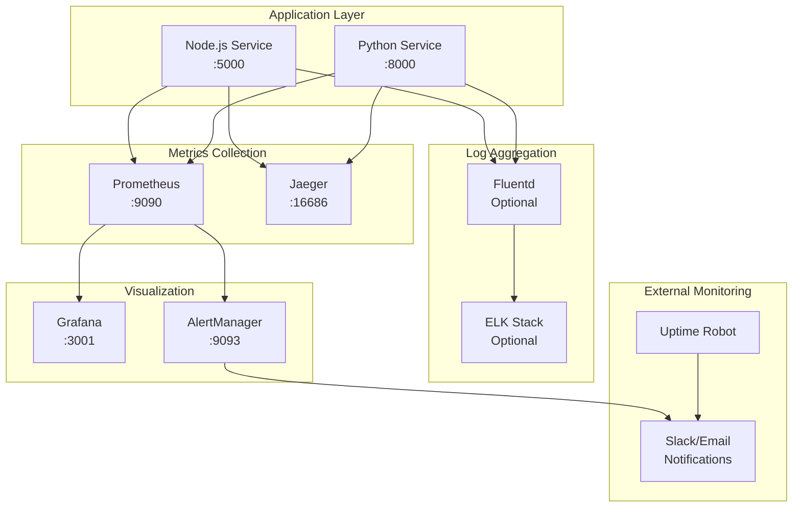

# Мониторинг и логирование Python сервиса

## Архитектура мониторинга



## Prometheus метрики

### Системные метрики

```python
from prometheus_client import Counter, Histogram, Gauge, Info

# Информация о сервисе
SERVICE_INFO = Info('anilibria_service_info', 'AniLibria Python Service Information')
SERVICE_INFO.info({
    'version': '1.0.0',
    'python_version': '3.11',
    'anilibria_py_version': '1.2.0'
})

# Счетчики запросов
HTTP_REQUESTS_TOTAL = Counter(
    'anilibria_http_requests_total',
    'Total HTTP requests',
    ['method', 'endpoint', 'status_code']
)

# Время ответа HTTP запросов
HTTP_REQUEST_DURATION = Histogram(
    'anilibria_http_request_duration_seconds',
    'HTTP request duration in seconds',
    ['method', 'endpoint'],
    buckets=[0.1, 0.25, 0.5, 1.0, 2.5, 5.0, 10.0]
)

# Активные соединения
ACTIVE_CONNECTIONS = Gauge(
    'anilibria_active_connections',
    'Number of active connections',
    ['connection_type']
)

# WebSocket соединения
WEBSOCKET_CONNECTIONS = Gauge(
    'anilibria_websocket_connections_active',
    'Active WebSocket connections'
)

WEBSOCKET_MESSAGES = Counter(
    'anilibria_websocket_messages_total',
    'Total WebSocket messages',
    ['direction', 'message_type']
)

# Кеш метрики
CACHE_OPERATIONS = Counter(
    'anilibria_cache_operations_total',
    'Total cache operations',
    ['operation', 'cache_level', 'result']
)

CACHE_HIT_RATE = Gauge(
    'anilibria_cache_hit_rate',
    'Cache hit rate',
    ['cache_level']
)

CACHE_SIZE = Gauge(
    'anilibria_cache_size_bytes',
    'Cache size in bytes',
    ['cache_level']
)

# База данных метрики
DATABASE_OPERATIONS = Counter(
    'anilibria_database_operations_total',
    'Total database operations',
    ['operation', 'collection', 'result']
)

DATABASE_OPERATION_DURATION = Histogram(
    'anilibria_database_operation_duration_seconds',
    'Database operation duration in seconds',
    ['operation', 'collection'],
    buckets=[0.01, 0.05, 0.1, 0.25, 0.5, 1.0, 2.5]
)

DATABASE_CONNECTION_POOL = Gauge(
    'anilibria_database_connection_pool',
    'Database connection pool status',
    ['status']
)

# AniLibria API метрики
ANILIBRIA_API_REQUESTS = Counter(
    'anilibria_api_requests_total',
    'Total requests to AniLibria API',
    ['endpoint', 'status_code']
)

ANILIBRIA_API_DURATION = Histogram(
    'anilibria_api_request_duration_seconds',
    'AniLibria API request duration in seconds',
    ['endpoint'],
    buckets=[0.5, 1.0, 2.5, 5.0, 10.0, 30.0]
)

ANILIBRIA_API_RATE_LIMIT = Gauge(
    'anilibria_api_rate_limit_remaining',
    'Remaining AniLibria API rate limit'
)

# Бизнес метрики
TITLES_SYNCED = Counter(
    'anilibria_titles_synced_total',
    'Total titles synchronized',
    ['source']
)

EPISODES_PROCESSED = Counter(
    'anilibria_episodes_processed_total',
    'Total episodes processed',
    ['action']
)

NOTIFICATIONS_SENT = Counter(
    'anilibria_notifications_sent_total',
    'Total notifications sent',
    ['type', 'channel']
)

# Ошибки и исключения
ERRORS_TOTAL = Counter(
    'anilibria_errors_total',
    'Total errors',
    ['error_type', 'component']
)

CIRCUIT_BREAKER_STATE = Gauge(
    'anilibria_circuit_breaker_state',
    'Circuit breaker state (0=closed, 1=open, 2=half-open)',
    ['service']
)
```

### Middleware для сбора метрик

```python
import time
from fastapi import Request, Response
from starlette.middleware.base import BaseHTTPMiddleware

class MetricsMiddleware(BaseHTTPMiddleware):
    async def dispatch(self, request: Request, call_next):
        start_time = time.time()
        
        # Увеличиваем счетчик активных соединений
        ACTIVE_CONNECTIONS.labels(connection_type='http').inc()
        
        try:
            response = await call_next(request)
            
            # Записываем метрики
            duration = time.time() - start_time
            
            HTTP_REQUESTS_TOTAL.labels(
                method=request.method,
                endpoint=request.url.path,
                status_code=response.status_code
            ).inc()
            
            HTTP_REQUEST_DURATION.labels(
                method=request.method,
                endpoint=request.url.path
            ).observe(duration)
            
            return response
            
        except Exception as e:
            ERRORS_TOTAL.labels(
                error_type=type(e).__name__,
                component='http_middleware'
            ).inc()
            raise
        finally:
            ACTIVE_CONNECTIONS.labels(connection_type='http').dec()
```

## Структурированное логирование

### Конфигурация логирования

```python
import structlog
import logging
from pythonjsonlogger import jsonlogger

# Настройка структурированного логирования
structlog.configure(
    processors=[
        structlog.stdlib.filter_by_level,
        structlog.stdlib.add_logger_name,
        structlog.stdlib.add_log_level,
        structlog.stdlib.PositionalArgumentsFormatter(),
        structlog.processors.TimeStamper(fmt="iso"),
        structlog.processors.StackInfoRenderer(),
        structlog.processors.format_exc_info,
        structlog.processors.UnicodeDecoder(),
        structlog.processors.JSONRenderer()
    ],
    context_class=dict,
    logger_factory=structlog.stdlib.LoggerFactory(),
    wrapper_class=structlog.stdlib.BoundLogger,
    cache_logger_on_first_use=True,
)

# Настройка стандартного логгера
def setup_logging(log_level: str = "INFO"):
    logging.basicConfig(
        level=getattr(logging, log_level.upper()),
        format='%(message)s'
    )
    
    # JSON formatter для продакшена
    if os.getenv('ENVIRONMENT') == 'production':
        handler = logging.StreamHandler()
        formatter = jsonlogger.JsonFormatter(
            '%(asctime)s %(name)s %(levelname)s %(message)s'
        )
        handler.setFormatter(formatter)
        
        root_logger = logging.getLogger()
        root_logger.handlers.clear()
        root_logger.addHandler(handler)

# Создание логгера
logger = structlog.get_logger(__name__)
```

### Контекстное логирование

```python
from contextvars import ContextVar
import uuid

# Контекстные переменные для трассировки
request_id_var: ContextVar[str] = ContextVar('request_id', default='')
user_id_var: ContextVar[str] = ContextVar('user_id', default='')

class LoggingMiddleware(BaseHTTPMiddleware):
    async def dispatch(self, request: Request, call_next):
        # Генерируем уникальный ID запроса
        request_id = str(uuid.uuid4())
        request_id_var.set(request_id)
        
        # Извлекаем user_id из JWT токена если есть
        user_id = self.extract_user_id(request)
        if user_id:
            user_id_var.set(user_id)
        
        # Добавляем заголовок с request_id
        request.state.request_id = request_id
        
        logger.info(
            "Request started",
            request_id=request_id,
            method=request.method,
            path=request.url.path,
            user_id=user_id,
            user_agent=request.headers.get('user-agent'),
            ip=request.client.host
        )
        
        start_time = time.time()
        
        try:
            response = await call_next(request)
            
            duration = time.time() - start_time
            
            logger.info(
                "Request completed",
                request_id=request_id,
                status_code=response.status_code,
                duration=duration,
                user_id=user_id
            )
            
            # Добавляем request_id в заголовки ответа
            response.headers["X-Request-ID"] = request_id
            
            return response
            
        except Exception as e:
            duration = time.time() - start_time
            
            logger.error(
                "Request failed",
                request_id=request_id,
                error=str(e),
                error_type=type(e).__name__,
                duration=duration,
                user_id=user_id,
                exc_info=True
            )
            raise
```

### Логирование бизнес-событий

```python
class AnilibriaService:
    def __init__(self):
        self.logger = structlog.get_logger(__name__)
    
    async def sync_title(self, title_id: int):
        self.logger.info(
            "Title sync started",
            title_id=title_id,
            action="sync_title"
        )
        
        try:
            # Получение данных из API
            self.logger.debug(
                "Fetching title from AniLibria API",
                title_id=title_id
            )
            
            title_data = await self.anilibria_client.get_title(title_id)
            
            # Сохранение в базу данных
            self.logger.debug(
                "Saving title to database",
                title_id=title_id,
                episodes_count=len(title_data.get('player', {}).get('list', {}))
            )
            
            await self.save_title(title_data)
            
            # Обновление кеша
            await self.update_cache(title_id, title_data)
            
            self.logger.info(
                "Title sync completed successfully",
                title_id=title_id,
                action="sync_title",
                episodes_count=len(title_data.get('player', {}).get('list', {}))
            )
            
            # Метрика
            TITLES_SYNCED.labels(source='anilibria_api').inc()
            
            return title_data
            
        except Exception as e:
            self.logger.error(
                "Title sync failed",
                title_id=title_id,
                action="sync_title",
                error=str(e),
                error_type=type(e).__name__,
                exc_info=True
            )
            
            ERRORS_TOTAL.labels(
                error_type=type(e).__name__,
                component='title_sync'
            ).inc()
            
            raise
```

## Distributed Tracing с Jaeger

### Настройка OpenTelemetry

```python
from opentelemetry import trace
from opentelemetry.exporter.jaeger.thrift import JaegerExporter
from opentelemetry.sdk.trace import TracerProvider
from opentelemetry.sdk.trace.export import BatchSpanProcessor
from opentelemetry.instrumentation.fastapi import FastAPIInstrumentor
from opentelemetry.instrumentation.httpx import HTTPXClientInstrumentor
from opentelemetry.instrumentation.pymongo import PymongoInstrumentor
from opentelemetry.instrumentation.redis import RedisInstrumentor

def setup_tracing(service_name: str = "anilibria-python-service"):
    # Настройка провайдера трассировки
    trace.set_tracer_provider(TracerProvider())
    tracer = trace.get_tracer(__name__)
    
    # Настройка экспортера Jaeger
    jaeger_exporter = JaegerExporter(
        agent_host_name=os.getenv("JAEGER_AGENT_HOST", "jaeger"),
        agent_port=int(os.getenv("JAEGER_AGENT_PORT", "6831")),
    )
    
    # Настройка процессора спанов
    span_processor = BatchSpanProcessor(jaeger_exporter)
    trace.get_tracer_provider().add_span_processor(span_processor)
    
    return tracer

# Инструментация библиотек
def instrument_libraries(app):
    FastAPIInstrumentor.instrument_app(app)
    HTTPXClientInstrumentor().instrument()
    PymongoInstrumentor().instrument()
    RedisInstrumentor().instrument()
```

### Использование трассировки в коде

```python
from opentelemetry import trace

tracer = trace.get_tracer(__name__)

class AnilibriaService:
    async def get_title_with_tracing(self, title_id: int):
        with tracer.start_as_current_span("get_title") as span:
            span.set_attribute("title_id", title_id)
            span.set_attribute("service.name", "anilibria-python")
            
            # Проверка кеша
            with tracer.start_as_current_span("cache_lookup") as cache_span:
                cache_span.set_attribute("cache.level", "memory")
                cached_title = await self.get_from_memory_cache(title_id)
                
                if cached_title:
                    cache_span.set_attribute("cache.hit", True)
                    span.set_attribute("cache.source", "memory")
                    return cached_title
                
                cache_span.set_attribute("cache.hit", False)
            
            # Проверка Redis
            with tracer.start_as_current_span("redis_lookup") as redis_span:
                redis_span.set_attribute("cache.level", "redis")
                redis_title = await self.get_from_redis_cache(title_id)
                
                if redis_title:
                    redis_span.set_attribute("cache.hit", True)
                    span.set_attribute("cache.source", "redis")
                    return redis_title
                
                redis_span.set_attribute("cache.hit", False)
            
            # Запрос к API
            with tracer.start_as_current_span("anilibria_api_call") as api_span:
                api_span.set_attribute("external.service", "anilibria.tv")
                api_span.set_attribute("http.method", "GET")
                api_span.set_attribute("http.url", f"/title?id={title_id}")
                
                try:
                    title = await self.anilibria_client.get_title(title_id)
                    api_span.set_attribute("http.status_code", 200)
                    span.set_attribute("title.episodes_count", 
                                     len(title.get('player', {}).get('list', {})))
                    
                    # Сохранение в кеш
                    with tracer.start_as_current_span("cache_store"):
                        await self.store_in_cache(title_id, title)
                    
                    return title
                    
                except Exception as e:
                    api_span.set_attribute("error", True)
                    api_span.set_attribute("error.message", str(e))
                    api_span.set_attribute("http.status_code", 500)
                    raise
```

## Grafana Dashboard

### Основные панели

```json
{
  "dashboard": {
    "title": "AniLibria Python Service",
    "panels": [
      {
        "title": "Request Rate",
        "type": "graph",
        "targets": [
          {
            "expr": "rate(anilibria_http_requests_total[5m])",
            "legendFormat": "{{method}} {{endpoint}}"
          }
        ]
      },
      {
        "title": "Response Time",
        "type": "graph",
        "targets": [
          {
            "expr": "histogram_quantile(0.95, rate(anilibria_http_request_duration_seconds_bucket[5m]))",
            "legendFormat": "95th percentile"
          },
          {
            "expr": "histogram_quantile(0.50, rate(anilibria_http_request_duration_seconds_bucket[5m]))",
            "legendFormat": "50th percentile"
          }
        ]
      },
      {
        "title": "Error Rate",
        "type": "graph",
        "targets": [
          {
            "expr": "rate(anilibria_http_requests_total{status_code=~\"4..|5..\"}[5m])",
            "legendFormat": "Error rate"
          }
        ]
      },
      {
        "title": "Cache Hit Rate",
        "type": "singlestat",
        "targets": [
          {
            "expr": "anilibria_cache_hit_rate",
            "legendFormat": "{{cache_level}}"
          }
        ]
      },
      {
        "title": "WebSocket Connections",
        "type": "graph",
        "targets": [
          {
            "expr": "anilibria_websocket_connections_active",
            "legendFormat": "Active connections"
          }
        ]
      },
      {
        "title": "Database Operations",
        "type": "graph",
        "targets": [
          {
            "expr": "rate(anilibria_database_operations_total[5m])",
            "legendFormat": "{{operation}} {{collection}}"
          }
        ]
      },
      {
        "title": "AniLibria API Status",
        "type": "graph",
        "targets": [
          {
            "expr": "rate(anilibria_api_requests_total[5m])",
            "legendFormat": "{{endpoint}} - {{status_code}}"
          }
        ]
      }
    ]
  }
}
```

## Алерты и уведомления

### Prometheus Alert Rules

```yaml
# alerts.yml
groups:
  - name: anilibria-python-service
    rules:
      - alert: HighErrorRate
        expr: rate(anilibria_http_requests_total{status_code=~"5.."}[5m]) > 0.1
        for: 5m
        labels:
          severity: critical
        annotations:
          summary: "High error rate in AniLibria Python service"
          description: "Error rate is {{ $value }} errors per second"
      
      - alert: HighResponseTime
        expr: histogram_quantile(0.95, rate(anilibria_http_request_duration_seconds_bucket[5m])) > 5
        for: 5m
        labels:
          severity: warning
        annotations:
          summary: "High response time in AniLibria Python service"
          description: "95th percentile response time is {{ $value }} seconds"
      
      - alert: LowCacheHitRate
        expr: anilibria_cache_hit_rate < 0.7
        for: 10m
        labels:
          severity: warning
        annotations:
          summary: "Low cache hit rate"
          description: "Cache hit rate is {{ $value }}"
      
      - alert: ServiceDown
        expr: up{job="anilibria-python-service"} == 0
        for: 1m
        labels:
          severity: critical
        annotations:
          summary: "AniLibria Python service is down"
          description: "Service has been down for more than 1 minute"
      
      - alert: DatabaseConnectionIssues
        expr: anilibria_database_connection_pool{status="available"} < 5
        for: 5m
        labels:
          severity: warning
        annotations:
          summary: "Low database connection pool"
          description: "Available connections: {{ $value }}"
      
      - alert: AnilibriaAPIDown
        expr: rate(anilibria_api_requests_total{status_code=~"5.."}[5m]) > 0.5
        for: 5m
        labels:
          severity: critical
        annotations:
          summary: "AniLibria API is experiencing issues"
          description: "High error rate from AniLibria API"
```

### AlertManager конфигурация

```yaml
# alertmanager.yml
global:
  smtp_smarthost: 'localhost:587'
  smtp_from: 'alerts@anime-site.com'

route:
  group_by: ['alertname']
  group_wait: 10s
  group_interval: 10s
  repeat_interval: 1h
  receiver: 'web.hook'

receivers:
  - name: 'web.hook'
    slack_configs:
      - api_url: 'YOUR_SLACK_WEBHOOK_URL'
        channel: '#alerts'
        title: 'AniLibria Service Alert'
        text: '{{ range .Alerts }}{{ .Annotations.summary }}{{ end }}'
    
    email_configs:
      - to: 'admin@anime-site.com'
        subject: 'AniLibria Service Alert'
        body: |
          {{ range .Alerts }}
          Alert: {{ .Annotations.summary }}
          Description: {{ .Annotations.description }}
          {{ end }}
```

## Health Checks

### Комплексный health check endpoint

```python
from fastapi import APIRouter, HTTPException
from datetime import datetime
import asyncio

router = APIRouter()

@router.get("/health")
async def health_check():
    health_status = {
        "status": "healthy",
        "timestamp": datetime.utcnow().isoformat(),
        "version": "1.0.0",
        "checks": {}
    }
    
    # Проверка базы данных
    try:
        await check_database()
        health_status["checks"]["database"] = {
            "status": "healthy",
            "response_time": await measure_db_response_time()
        }
    except Exception as e:
        health_status["checks"]["database"] = {
            "status": "unhealthy",
            "error": str(e)
        }
        health_status["status"] = "unhealthy"
    
    # Проверка Redis
    try:
        await check_redis()
        health_status["checks"]["redis"] = {
            "status": "healthy",
            "response_time": await measure_redis_response_time()
        }
    except Exception as e:
        health_status["checks"]["redis"] = {
            "status": "unhealthy",
            "error": str(e)
        }
        health_status["status"] = "unhealthy"
    
    # Проверка AniLibria API
    try:
        api_status = await check_anilibria_api()
        health_status["checks"]["anilibria_api"] = api_status
    except Exception as e:
        health_status["checks"]["anilibria_api"] = {
            "status": "unhealthy",
            "error": str(e)
        }
        # API недоступность не критична
    
    # Проверка внутренних сервисов
    try:
        nodejs_status = await check_nodejs_service()
        health_status["checks"]["nodejs_service"] = nodejs_status
    except Exception as e:
        health_status["checks"]["nodejs_service"] = {
            "status": "unhealthy",
            "error": str(e)
        }
    
    if health_status["status"] == "unhealthy":
        raise HTTPException(status_code=503, detail=health_status)
    
    return health_status

async def check_database():
    # Простой запрос к базе данных
    await db.command("ping")

async def check_redis():
    # Проверка Redis соединения
    await redis.ping()

async def check_anilibria_api():
    # Проверка доступности AniLibria API
    start_time = time.time()
    try:
        async with httpx.AsyncClient() as client:
            response = await client.get(
                "https://api.anilibria.tv/v3/title/random",
                timeout=5.0
            )
            response_time = time.time() - start_time
            
            if response.status_code == 200:
                return {
                    "status": "healthy",
                    "response_time": response_time
                }
            else:
                return {
                    "status": "degraded",
                    "response_time": response_time,
                    "status_code": response.status_code
                }
    except Exception as e:
        return {
            "status": "unhealthy",
            "error": str(e),
            "response_time": time.time() - start_time
        }
```

Эта система мониторинга обеспечивает полную наблюдаемость Python сервиса с детальными метриками, структурированным логированием, distributed tracing и автоматическими алертами.