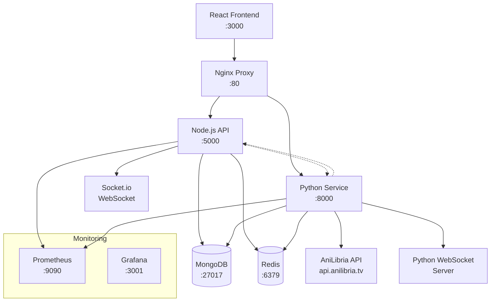

# Архитектура интеграции Python сервиса с anilibria.py

## Анализ текущей архитектуры

### Существующая система
- **Frontend**: React.js приложение (порт 3000)
- **Backend**: Node.js/Express API сервер (порт 5000)
- **Database**: MongoDB для хранения данных
- **Cache**: Redis для кеширования
- **Proxy**: Nginx для маршрутизации запросов
- **Real-time**: Socket.io для WebSocket соединений
- **Monitoring**: Prometheus + Grafana (опционально)

### Текущая интеграция с AniLibria
- **JavaScript сервис**: `server/services/anilibriaService.js`
- **REST API**: Прямые HTTP запросы к `api.anilibria.tv`
- **Контроллер**: `server/controllers/anilibriaController.js`
- **Маршруты**: `/api/anilibria/*`
- **Кеширование**: Базовое кеширование в памяти

## Архитектура Python микросервиса

### Обзор решения
Создание отдельного Python микросервиса, который будет:
1. Использовать библиотеку `anilibria.py` для более эффективной работы с API
2. Предоставлять WebSocket поддержку для real-time уведомлений
3. Обеспечивать расширенное кеширование и синхронизацию
4. Работать параллельно с существующим Node.js сервисом



### Структура Python сервиса

```
python-service/
├── app/
│   ├── __init__.py
│   ├── main.py                 # FastAPI приложение
│   ├── config.py              # Конфигурация
│   ├── models/
│   │   ├── __init__.py
│   │   ├── anime.py           # Pydantic модели
│   │   └── websocket.py       # WebSocket модели
│   ├── services/
│   │   ├── __init__.py
│   │   ├── anilibria_service.py  # Основной сервис с anilibria.py
│   │   ├── cache_service.py      # Redis кеширование
│   │   ├── websocket_service.py  # WebSocket обработка
│   │   └── sync_service.py       # Синхронизация с MongoDB
│   ├── api/
│   │   ├── __init__.py
│   │   ├── routes/
│   │   │   ├── __init__.py
│   │   │   ├── anilibria.py      # REST API endpoints
│   │   │   └── websocket.py      # WebSocket endpoints
│   │   └── middleware/
│   │       ├── __init__.py
│   │       ├── auth.py           # Аутентификация
│   │       └── rate_limit.py     # Rate limiting
│   ├── utils/
│   │   ├── __init__.py
│   │   ├── logger.py             # Логирование
│   │   └── metrics.py            # Prometheus метрики
│   └── tasks/
│       ├── __init__.py
│       ├── scheduler.py          # Celery/APScheduler
│       └── sync_tasks.py         # Фоновые задачи
├── requirements.txt
├── Dockerfile
├── docker-compose.override.yml
└── README.md
```

## Технологический стек Python сервиса

### Основные библиотеки
- **FastAPI**: Современный, быстрый веб-фреймворк
- **anilibria.py**: Официальная библиотека для работы с AniLibria API
- **uvicorn**: ASGI сервер для FastAPI
- **pydantic**: Валидация данных и сериализация
- **motor**: Асинхронный драйвер MongoDB
- **aioredis**: Асинхронный клиент Redis
- **websockets**: WebSocket поддержка
- **celery**: Фоновые задачи (опционально)
- **prometheus-client**: Метрики для мониторинга

### Дополнительные инструменты
- **APScheduler**: Планировщик задач
- **structlog**: Структурированное логирование
- **httpx**: HTTP клиент для внутренних запросов
- **pytest**: Тестирование
- **black**: Форматирование кода
- **mypy**: Статическая типизация

## Интеграционные паттерны

### 1. Гибридный подход
- **Node.js сервис**: Обрабатывает основную бизнес-логику, аутентификацию, пользователей
- **Python сервис**: Специализируется на работе с AniLibria API и real-time уведомлениях

### 2. API Gateway паттерн
- **Nginx**: Маршрутизирует запросы между сервисами
- **Маршрутизация**:
  - `/api/anilibria/v2/*` → Python сервис
  - `/api/anilibria/ws/*` → Python WebSocket
  - `/api/*` → Node.js сервис (по умолчанию)

### 3. Event-Driven Architecture
- **События**: Новые релизы, обновления эпизодов, изменения статуса
- **Pub/Sub**: Redis для обмена событиями между сервисами
- **WebSocket**: Real-time уведомления клиентам

## Преимущества архитектуры

### Технические преимущества
1. **Специализация**: Python сервис оптимизирован для работы с AniLibria
2. **WebSocket поддержка**: Нативная поддержка real-time уведомлений
3. **Масштабируемость**: Независимое масштабирование сервисов
4. **Отказоустойчивость**: Fallback между сервисами
5. **Производительность**: Асинхронная обработка запросов

### Функциональные преимущества
1. **Real-time уведомления**: О новых эпизодах и релизах
2. **Расширенное кеширование**: Многоуровневое кеширование данных
3. **Автоматическая синхронизация**: Фоновое обновление данных
4. **Мониторинг**: Детальные метрики и логирование
5. **Совместимость**: Полная совместимость с существующим API

## Стратегия развертывания

### Поэтапное внедрение
1. **Фаза 1**: Создание Python сервиса с базовым API
2. **Фаза 2**: Интеграция WebSocket функциональности
3. **Фаза 3**: Миграция части запросов на Python сервис
4. **Фаза 4**: Полная интеграция и оптимизация

### Стратегия совместимости
- **Версионирование API**: `/api/anilibria/v1/` (Node.js) и `/api/anilibria/v2/` (Python)
- **Graceful fallback**: Автоматическое переключение при недоступности сервиса
- **Постепенная миграция**: Поэтапный перевод функций на Python сервис

## Мониторинг и наблюдаемость

### Метрики
- **Производительность**: Время ответа, throughput, ошибки
- **Бизнес-метрики**: Количество запросов к AniLibria, кеш hit rate
- **Системные метрики**: CPU, память, сетевые соединения

### Логирование
- **Структурированные логи**: JSON формат для легкого парсинга
- **Корреляция**: Трассировка запросов между сервисами
- **Уровни логирования**: DEBUG, INFO, WARNING, ERROR, CRITICAL

### Алерты
- **Доступность сервиса**: Health check endpoints
- **Производительность**: SLA нарушения
- **Ошибки**: Критические ошибки и исключения

## Безопасность

### Аутентификация и авторизация
- **JWT токены**: Валидация токенов от Node.js сервиса
- **Rate limiting**: Ограничение запросов по IP и пользователю
- **CORS**: Настройка для безопасного взаимодействия

### Сетевая безопасность
- **Internal network**: Изоляция сервисов в Docker сети
- **TLS**: Шифрование трафика между сервисами
- **Secrets management**: Безопасное хранение API ключей

## Следующие шаги

1. **Создание базовой структуры** Python сервиса
2. **Настройка Docker** конфигурации
3. **Интеграция с существующей** инфраструктурой
4. **Разработка API** интерфейсов
5. **Тестирование** и оптимизация